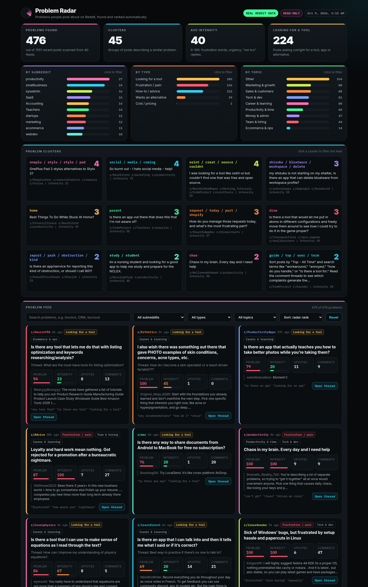

# Problem Radar

**Find the problems people post about on Reddit.** Problem Radar reads recent posts from a list of subreddits and searches, detects posts where someone describes a real problem, pain or unmet need, writes a one-line problem statement, scores it, and groups similar problems into clusters.

Live dashboard: **https://plutunieer.github.io/problem-radar/**



> Inspired by [Ownfeed](https://ownfeed.dev) ("a social feed of people who need your product"). Ownfeed starts from your product and finds people who need it. Problem Radar does only the first half on purpose: it finds the problems, without any product in mind.

## What it does

1. **Collect** recent posts from Reddit's public RSS feeds: `new` and `top of the week` per subreddit, plus Reddit-wide searches such as `"is there a tool"`, `"alternative to"`, `"wish there was"`. Requests are spaced 2.5 s apart with a descriptive User-Agent.
2. **Enrich** with upvote and comment counts from the public [Arctic Shift](https://github.com/ArthurHeitmann/arctic_shift) archive (a snapshot, it can lag behind Reddit), and read the top comments of the 30 strongest candidates ("same here", "did you find anything?" raise intensity).
3. **Detect problems** (main feature, no API key needed): weighted phrase patterns for tool requests, alternatives, how-to questions, frustration and cost pain. Self-promotion ("I built...", "check out...") is penalised. Each problem gets:
   - `statement`: the single most problem-like sentence
   - `category`: Looking for a tool, Wants an alternative, How-to / advice, Frustration / pain, Cost / pricing
   - `topics`: Marketing & growth, Money & admin, Productivity & time, ...
   - `problem_score` (0-100), `intensity` (0-100), upvotes, comments
   - `rank`: problem score x engagement, with a 14-day half-life so fresh posts rise
4. **Optional LLM refine**: if `OPENAI_API_KEY` or `GEMINI_API_KEY` is set, the top 80 candidates are re-checked (real problem or not, cleaner one-line statement, intensity). Without a key this step is skipped.
5. **Cluster** similar problems (TF-IDF + cosine similarity, stdlib only).
6. Write `data/problems.json`; `index.html` renders it. No build step.

## Run it

```bash
python3 radar.py          # stdlib only, about 3-5 minutes
python3 -m http.server    # open http://localhost:8000
```

Edit `config.json` to change subreddits, searches, delay and thresholds.

### Daily run on GitHub Actions (optional)

Copy `setup/radar.yml` to `.github/workflows/radar.yml` (the file sits in `setup/` because the publishing token had no workflow scope). Optionally add `OPENAI_API_KEY` or `GEMINI_API_KEY` under Settings > Secrets > Actions. Note: Reddit sometimes blocks requests from cloud IPs; if the run collects nothing, the previous `data/problems.json` is kept.

## Read-only, and Reddit's rules

- Problem Radar **only reads public feeds**. It never posts, comments, votes, messages or logs in.
- It uses Reddit's public RSS feeds at a low request rate. For anything beyond personal research, read and follow the [Reddit User Agreement](https://redditinc.com/policies/user-agreement), the [Data API Terms](https://redditinc.com/policies/data-api-terms) and each subreddit's rules. Heavier or commercial use requires Reddit's official API.
- If you reply to someone you found here, do it by hand, be helpful, and respect self-promotion rules.

## Files

| File | What |
|---|---|
| `radar.py` | collector + problem detection + clustering |
| `config.json` | subreddits, searches, rate limit, threshold |
| `data/problems.json` | latest run |
| `index.html` | dashboard (problem feed, clusters, filters) |
| `setup/radar.yml` | optional daily GitHub Action |

---

## Kurzanleitung (Deutsch)

Problem Radar findet Probleme, über die Leute auf Reddit schreiben, bewertet sie und gruppiert ähnliche Probleme.

1. `python3 radar.py` ausführen (nur Python, keine Pakete, kein Key nötig).
2. `python3 -m http.server` starten und `http://localhost:8000` öffnen.
3. Subreddits und Suchbegriffe in `config.json` anpassen.
4. Optional täglich: `setup/radar.yml` nach `.github/workflows/` kopieren. Mit `OPENAI_API_KEY` oder `GEMINI_API_KEY` als Secret werden die Problem-Sätze zusätzlich per KI verfeinert.

Das Tool liest nur öffentliche Feeds und postet, kommentiert oder votet nie. Bitte die Reddit-Nutzungsbedingungen und die Regeln der Subreddits beachten.

Inspiriert von [Ownfeed](https://ownfeed.dev).
